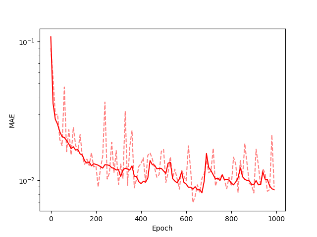
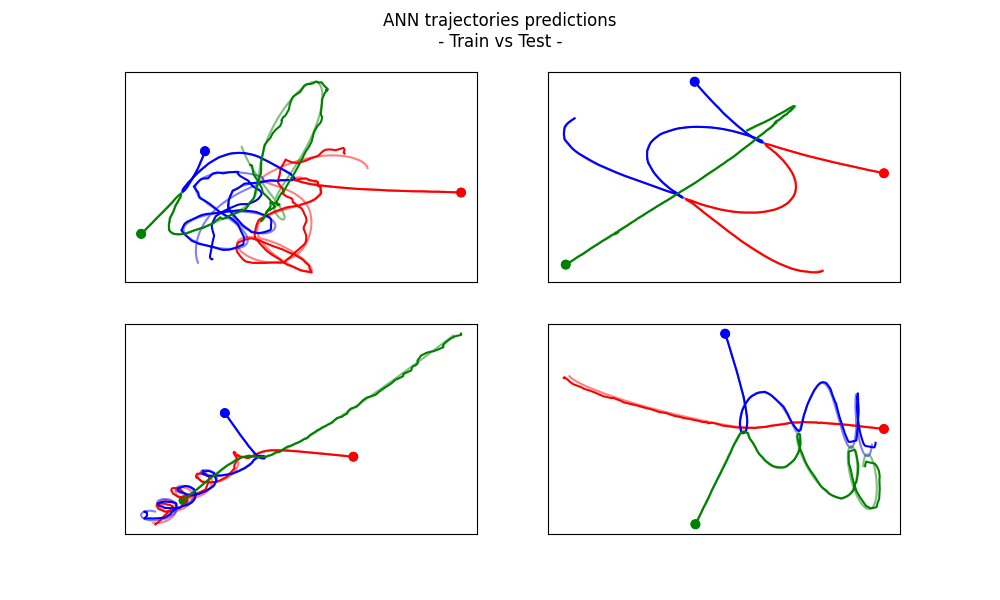

# Newton-vs-the-machine-solving-the-chaotic-three-body-problem-using-deep-neural-networks

This repository is going to work through the paper *paper.pdf*. 

## Network Architecture

The network architecture can be found on the 3rd page of the paper:

*We used a feed-forward ANN consisting of 10 hidden layers of 128 interconnected nodes (Fig. 2 and Appendix B). Training was performed using the adaptive moment estimation optimization algorithm ADAM (20) with 10,000 passes over the data, in which each epoch was separated into batches of 5000, and setting the rectified linear unit (ReLU) activation function to max(0, x) (Glorot, Bordes, and Bengio, 2011). (…) For each scenario, we assessed the loss-function (taken as the mean absolute error MAE) against epoch.*

This translates to the following Python code:

### Model Architecture

```python
def create_model():
    model = Sequential()
    model.add(Dense(128, activation='relu', input_dim=3))  # Input layer with the first hidden layer
    for _ in range(9):  # Remaining 9 hidden layers
        model.add(Dense(128, activation='relu'))
    model.add(Dense(4))  # Output layer
    return model
```

### Training

```python
def train(model, X_train, y_train, validation_data=None):
    # Compile the model
    model.compile(optimizer=Adam(), loss='mae')
    
    # Train the model
    history = model.fit(
        X_train,
        y_train,
        validation_data=validation_data,
        epochs=1000,
        batch_size=5000,
        verbose=1
    )
    
    return history
```

## Training Results

After completing the training, we obtain the following results:

### Mean Absolute Error (MAE) vs Epoch



**Figure:** The ANN follows the same training structure at each time interval. Solid lines represent the training loss, while dashed lines indicate validation loss. The results illustrate a typical ANN learning process—an initial phase of rapid learning, followed by slower learning where prediction improvements diminish over epochs.

### Validation of the Trained ANN



**Figure:** Two randomly selected examples from the training set (left) and two from the validation set (right). Bullets indicate initial conditions, while curves represent the orbits of the three bodies (red, blue, and green, the latter obtained from symmetry). The ANN-generated solutions (solid curves) closely match the reference numerical solutions (dashed), even for cases outside the training set.

## Final MAE Results

- **Training set:** 0.00783  
- **Validation set:** 0.00792  

## Conclusion

The model demonstrates remarkable accuracy for simple and distant interactions, even in the validation set. However, challenges arise when the three bodies are in close proximity, where interactions become highly complex and sensitive, as seen in the top-left trajectory. 

Nevertheless, as the paper states:

> *The ANN also closely matched the complicated behavior of the converged solutions in all scenarios not included in its training. Moreover, the ANN did this in fixed computational time (t ≈ 10⁻³ seconds), which is on average about 10⁵ (and sometimes even 10⁸) times faster than Brutus.*

For such a small and simple neural network, these results bring us closer to solving problems that have puzzled scientists for centuries. While the model does not yet account for variations in mass and is limited to a timeframe under 10 seconds, further advancements hold significant promise.

To illustrate the trajectories more clearly, I created animations for each plot (attached in the email). These animations visualize real-time motion, with a **tail** (alpha=0.5) representing the Brutus numerical approximation and a moving circle indicating the ANN's prediction. Ideally, the circle closely follows the end of the tail, demonstrating the ANN’s accuracy in approximating complex trajectories.
